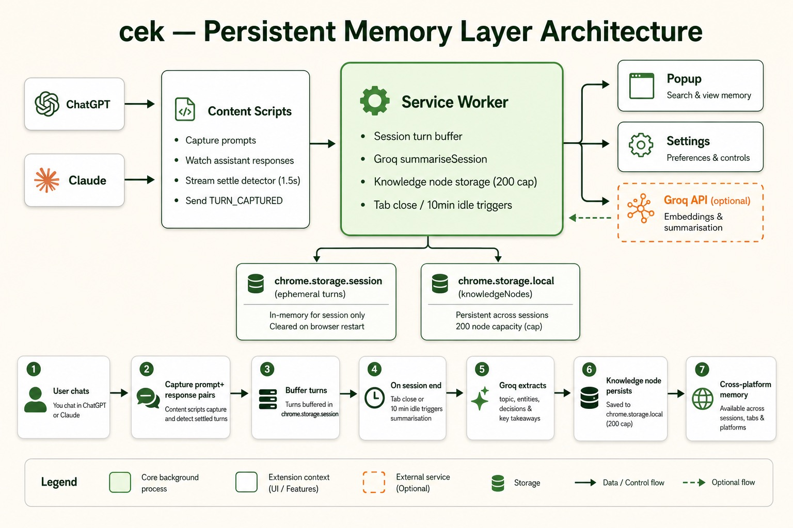

<p align="center">
  
</p>

<h1 align="center">cek</h1>

<p align="center">
  <strong>Your AI conversations build a knowledge base that travels with you.</strong><br/>
  A passive memory layer above ChatGPT and Claude — no manual input, no backend, no account.
</p>

<p align="center">
  <a href="LICENSE"></a>
  <a href="#"></a>
  <a href="#"></a>
  <a href="#"></a>
</p>

---

## The problem

Every time you switch platforms (Claude → ChatGPT) or start a new chat, all context is lost. You rebuild the same background, re-explain the same decisions, and re-ask questions you already answered.

**cek fixes this passively.** While you chat, it captures full prompt+response turns, summarises sessions into structured memory nodes, and keeps that knowledge on your machine — ready to surface when you need it again.

---

## How it works

```
You chat on ChatGPT or Claude
        │
        ▼
cek captures each prompt + AI response (waits for streaming to finish)
        │
        ▼
Turns buffer in the session (ephemeral, per tab)
        │
        ▼
Session ends (tab close · 10 min idle · navigate away)
        │
        ▼
Groq extracts a KnowledgeNode: topic, entities, decisions, open questions
        │
        ▼
Node persists locally — your cross-platform memory graph grows automatically
```

No copy-paste. No note-taking. No cloud dashboard. Just chat like you normally do.

---

## Architecture

<p align="center">
  
</p>

| Component | What it does |
|-----------|--------------|
| **Response capture** | Watches the assistant DOM after each send. Uses a stream-settle detector (1.5s quiet + no streaming indicator) before storing the full response. |
| **Session buffer** | Holds prompt+response *turns* in `chrome.storage.session` — ephemeral, per tab, cleared after summarisation. |
| **Session summarisation** | On tab close, 10-minute idle, or navigating away from a chat URL, fires one Groq call to extract structured memory. |
| **Knowledge nodes** | Persistent `KnowledgeNode` records in `chrome.storage.local` — topic, entities, decisions, open questions (200-node cap). |
| **v1 utilities** | Context tracker, prompt history, and tier-based limit counting still run alongside the memory layer. |

### KnowledgeNode schema

Each summarised session becomes a searchable memory node:

```json
{
  "topic": "React useEffect cleanup patterns",
  "entities": ["useEffect", "subscriptions", "async cleanup"],
  "decisions": ["Always return cleanup fn for event listeners"],
  "openQuestions": ["Does this apply to async functions in effects?"],
  "platform": "claude",
  "turnCount": 12
}
```

Raw turn text is **not** stored long-term — only the distilled node persists, keeping storage lean under Chrome's quota.

### What's rolling out next

The v2 build plan also includes **context injection** (suggest relevant past sessions when you start a fresh chat) and a **knowledge graph page** (visualise nodes and connections). Both are in active development.

> **Gemini support** is scaffolded and coming after ChatGPT + Claude are fully stable.

---

## Features

### Persistent memory layer *(hero feature)*

The reason cek exists. Your AI chats automatically become structured, cross-platform memory.

- **Full turn capture** — prompt and assistant response stored together, not prompts in isolation
- **Streaming-aware** — MutationObserver waits for the stream to settle before capturing; partial capture on tab close as fallback
- **Automatic summarisation** — Groq extracts topic, entities, decisions, and open questions from the full conversation
- **Smart triggers** — summarises on tab close, 10 minutes of inactivity, or navigating away from the chat
- **Local knowledge graph** — up to 200 nodes persisted on your machine, searchable by precomputed tokens
- **Opt-in** — enable in Settings → **Session summarisation (knowledge graph)** with your own Groq API key

---

### Also built in

These v1 features still run quietly alongside the memory layer:

<details>
<summary><strong>Prompt history</strong> — auto-captured prompts, session grouping, pin/search/export</summary>

Every prompt is logged on send. Search by keyword, pin favourites, export as JSON. Optional Groq features: semantic search, auto session titles, near-duplicate detection.
</details>

<details>
<summary><strong>Context tracker</strong> — live token estimate with progress bar</summary>

Scrapes visible messages, estimates tokens (`chars ÷ 4`), shows amber/red warnings at 70%/90%. Model-aware limits (GPT-4o → 128k, Claude Sonnet → 200k).
</details>

<details>
<summary><strong>Daily & rolling limits</strong> — tier-aware message counting</summary>

| Platform | Tier | Window | Approx. limit |
|----------|------|--------|---------------|
| ChatGPT | Free | 24 h | 10 messages |
| ChatGPT | Plus | 3 h | 80 messages |
| Claude | Free | 24 h | 20 messages |
| Claude | Pro | 5 h | 45 messages |
</details>

---

## Example use cases

### 1. Claude deep-dive → fresh ChatGPT thread *(the core promise)*

You spend an hour with Claude debugging a React auth flow — discussing JWT refresh, cookie vs localStorage, and middleware patterns. You close the tab. cek captures every turn, waits for the stream to finish on each response, and when the session ends Groq summarises it into a node:

> **Topic:** React auth middleware patterns  
> **Decisions:** Use httpOnly cookies for refresh tokens  
> **Open questions:** How to handle SSR with Next.js middleware?

Next morning you open a blank ChatGPT chat to prototype the implementation. Your Claude context isn't lost — it lives in cek's knowledge graph. *(Context injection, coming soon, will surface this automatically when you start typing.)*

**Without cek:** Re-explain the entire auth architecture from scratch.  
**With cek:** Your decisions and open questions persist across platforms without you lifting a finger.

---

### 2. Research sprint across three sessions

You're doing competitive analysis — one ChatGPT thread for pricing, a Claude thread for feature matrices, another ChatGPT thread for GTM. Each tab close triggers summarisation. After a week you have a dozen knowledge nodes: entities like competitor names, decisions like pricing positioning, open questions about enterprise tiers.

Search your memory graph for "enterprise pricing" and find the node from Tuesday's Claude session — even though you never typed those exact words in the topic field.

**Without cek:** Three siloed conversations, nothing connected.  
**With cek:** A growing, structured knowledge base built entirely passively.

---

### 3. Long streaming response — captured correctly

You ask Claude to generate a 2,000-word architecture doc. The response streams for 45 seconds. cek's settle detector waits until streaming indicators disappear and the DOM is quiet for 1.5 seconds — then captures the complete response, not a partial chunk. The full turn enters the session buffer and gets summarised when you move on.

**Without cek:** Only your prompt is saved; the AI's actual answer is gone.  
**With cek:** The full exchange is captured and distilled into durable memory.

---

### 4. Idle session auto-saves while you context-switch

You're mid-conversation on ChatGPT but get pulled into a meeting. You leave the tab open, switch to Slack for 15 minutes. After 10 minutes of inactivity, cek triggers summarisation automatically — your partial session becomes a knowledge node before you even come back.

**Without cek:** Context lives only in a stale browser tab.  
**With cek:** Inactivity is a feature, not a failure mode.

---

### 5. Staying under limits while building memory

You're on ChatGPT Plus (`~12 left` in the popup). You batch final questions, knowing each one still feeds the memory layer. When you hit the limit, switch to Claude — your accumulated knowledge nodes from the ChatGPT session are already summarised and stored.

**Without cek:** Platform limits break your flow and lose context.  
**With cek:** Limits inform your routing; memory outlives any single platform's cap.

---

## Quick start

### Install

```bash
git clone https://github.com/Naseem9brev/Cek.git
cd Cek
npm install
npm run build
```

Load in Chrome:

1. Open `chrome://extensions`
2. Enable **Developer mode**
3. Click **Load unpacked** and select the `dist` folder

### Enable the memory layer

1. Click the cek icon (or press **Alt+Shift+C**)
2. Open **Settings** (gear icon)
3. Add your [Groq API key](https://console.groq.com)
4. Enable **Smart features** and **Session summarisation (knowledge graph)**
5. Set your ChatGPT / Claude subscription tiers (for limit tracking)

Chat normally. Close tabs. Your knowledge graph grows on its own.

---

## Development

```bash
npm run dev    # Vite dev server with @crxjs/vite-plugin hot reload
npm run build  # Generate icons, typecheck, production bundle
```

After code changes, reload the extension at `chrome://extensions`.

### Project structure

```
src/
├── background/
│   ├── service-worker.ts   message routing, v1 features
│   └── summarisation.ts    turn buffering, idle/tab triggers, Groq summarise
├── content/
│   ├── response-capture.ts stream settle detector, TURN_CAPTURED
│   ├── shared.ts             prompt capture + response watcher hook
│   ├── chatgpt.ts            ChatGPT selectors
│   └── claude.ts             Claude selectors
├── popup/                    history, context bar, search
├── settings/                 tiers, Groq, summarisation toggle
└── lib/
    ├── session-buffer.ts     ephemeral turn storage (chrome.storage.session)
    ├── knowledge-nodes.ts    persistent node storage + search tokens
    └── groq.ts               summariseSession, embed, titles
```

---

## Privacy

- **Default:** All data stays on your machine in Chrome storage. cek does not phone home.
- **Memory layer (Groq enabled):** Full conversation turns are sent to Groq's API at session end for summarisation. Raw turn text is discarded after the node is written — only the structured `KnowledgeNode` persists.
- **v1 smart features (Groq enabled):** Prompt text may also be sent for embeddings, titles, and duplicate detection.
- **Your API key** is stored locally and never shared with the cek project.
- **Permissions:** `storage`, `alarms`, `activeTab`, `tabs`, plus host access to `chatgpt.com`, `claude.ai`, and `api.groq.com`.

---

## License

[MIT](LICENSE) © 2026 Naseem9brev
