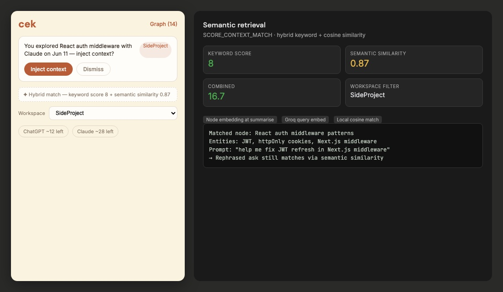
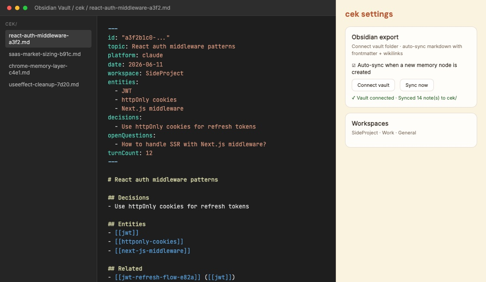
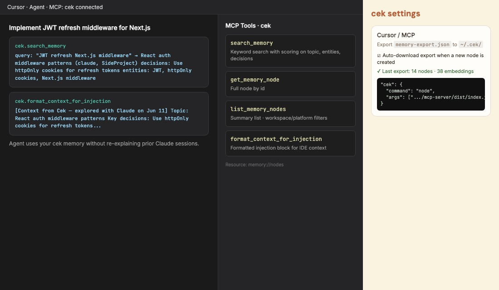
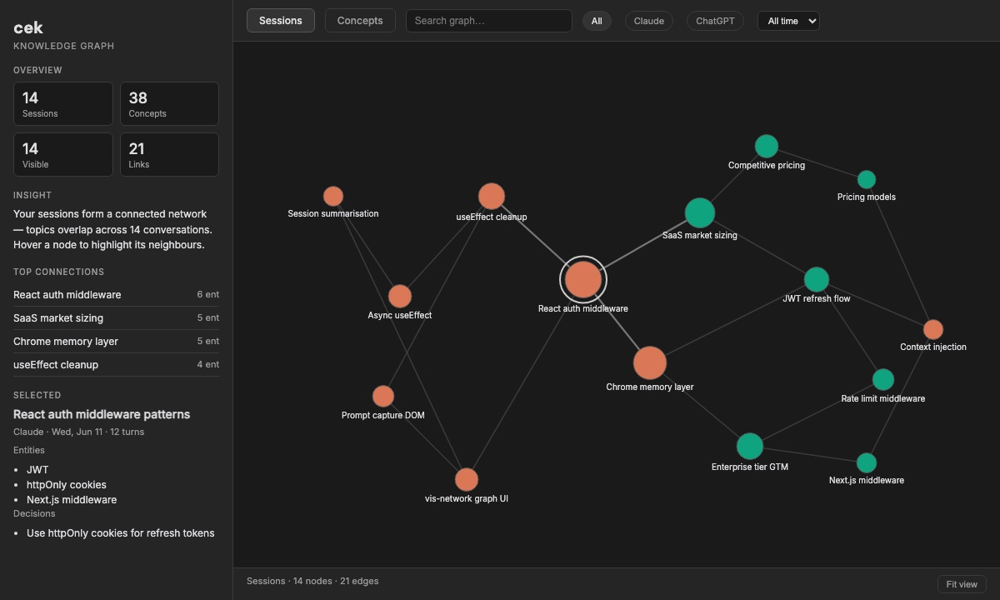

<p align="center">
  
</p>

<h1 align="center">cek</h1>

<p align="center">
  <strong>Your AI conversations build a knowledge base that travels with you.</strong><br/>
  Passive memory across ChatGPT and Claude — semantic retrieval, workspaces, Obsidian sync, and a Cursor MCP bridge.
</p>

<p align="center">
  <a href="LICENSE"></a>
  <a href="#"></a>
  <a href="#"></a>
  <a href="#"></a>
</p>

---

## The problem

Every time you switch platforms (Claude → ChatGPT) or start a new chat, all context is lost. You rebuild the same background, re-explain the same decisions, and re-ask questions you already answered.

**cek fixes this passively.** While you chat, it captures full prompt+response turns, summarises sessions into structured memory nodes, and keeps that knowledge on your machine — ready to surface when you need it again.

---

## How it works

```
You chat on ChatGPT or Claude
        │
        ▼
cek captures each prompt + AI response (waits for streaming to finish)
        │
        ▼
Turns buffer in the session (ephemeral, per tab)
        │
        ▼
Session ends (tab close · 10 min idle · navigate away)
        │
        ▼
Groq extracts a KnowledgeNode: topic, entities, decisions, open questions
        │
        ▼
Node persists locally — your cross-platform memory graph grows
        │
        ▼
Node embedding stored (Groq) for semantic retrieval later
        │
        ▼
Optional: sync to Obsidian vault · export for Cursor MCP
        │
        ▼
You start a fresh chat on another platform
        │
        ▼
cek hybrid-matches your prompt (keyword + cosine similarity)
        │
        ▼
One click injects context — scoped to your active workspace
```

No copy-paste. No note-taking. No cloud dashboard. Just chat like you normally do.

---

## Architecture

<p align="center">
  
</p>

| Component | What it does |
|-----------|--------------|
| **Response capture** | Watches the assistant DOM after each send. Uses a stream-settle detector (1.5s quiet + no streaming indicator) before storing the full response. |
| **Session buffer** | Holds prompt+response *turns* in `chrome.storage.session` — ephemeral, per tab, cleared after summarisation. |
| **Session summarisation** | On tab close, 10-minute idle, or navigating away from a chat URL, fires one Groq call to extract structured memory. |
| **Knowledge nodes** | Persistent `KnowledgeNode` records in `chrome.storage.local` — topic, entities, decisions, open questions (200-node cap). |
| **Context injection** | On a fresh chat, hybrid-matches your first prompt (keyword + semantic cosine similarity). Surfaces a match via badge, toast, and popup — one click prepends context to the composer. |
| **Semantic retrieval** | Node embeddings generated at summarisation time. `SCORE_CONTEXT_MATCH` combines keyword scoring with cosine similarity — catches rephrased asks that keyword-only search would miss. |
| **Workspaces** | Project profiles tag nodes on summarise. Scoped injection and filtering in popup + knowledge graph — keep Work separate from SideProject. |
| **Obsidian export** | Markdown notes with YAML frontmatter and `[[wikilinks]]`. Vault folder sync via File System Access API; manual export from popup. |
| **MCP bridge** | `mcp-server/` package reads `memory-export.json` so Cursor can `search_memory`, list nodes, and format injection blocks. Auto-download optional. |
| **Knowledge graph** | Dedicated graph page (vis-network) — nodes by topic, edges by shared entities, filter by platform, date, and workspace. |
| **v1 utilities** | Context tracker, prompt history, and tier-based limit counting still run alongside the memory layer. |

### KnowledgeNode schema

Each summarised session becomes a searchable memory node:

```json
{
  "topic": "React useEffect cleanup patterns",
  "entities": ["useEffect", "subscriptions", "async cleanup"],
  "decisions": ["Always return cleanup fn for event listeners"],
  "openQuestions": ["Does this apply to async functions in effects?"],
  "platform": "claude",
  "workspace": "SideProject",
  "turnCount": 12
}
```

Raw turn text is **not** stored long-term — only the distilled node persists, keeping storage lean under Chrome's quota.

---

## Context injection & semantic retrieval

When you open a **new or empty chat** and send your first prompt, cek checks whether you've explored this topic before — on any platform. Matching is **hybrid**: fast keyword + fuzzy scoring against node tokens, plus **cosine similarity** against node embeddings when Groq is enabled. No network call is required for injection itself; query embedding uses your Groq key only when scoring.

<p align="center">
  
</p>

<p align="center"><em>Hybrid match: keyword score + semantic similarity catches rephrased prompts. Workspace badge shows which project profile matched.</em></p>

### How semantic retrieval works

| Step | What happens |
|------|----------------|
| **At summarisation** | Groq embeds each new node's topic, entities, decisions, and open questions → stored in `nodeEmbeddings` |
| **On first prompt** | Background handler `SCORE_CONTEXT_MATCH` embeds your prompt (if Groq enabled) |
| **Hybrid score** | `keywordScore + semanticSimilarity × 10` — best match above threshold wins |
| **Workspace filter** | Only nodes tagged with your active workspace are considered (or all, if unset) |

### When it triggers

- Fresh chat: ≤1 user message in the thread, or URL is `/new`
- At least one `KnowledgeNode` already exists from a prior summarised session
- Your prompt scores above threshold via keyword **or** semantic similarity
- Runs **once per chat URL** — won't nag on every message

### What you see

| Surface | What happens |
|---------|----------------|
| **Extension badge** | `!` on the cek icon for that tab |
| **On-page toast** | Bottom-right prompt with **Inject context** / **Dismiss** |
| **Popup banner** | Match text + workspace badge + inject/dismiss buttons |

### What gets injected

One click prepends a compact block into the chat composer:

```
[Context from Cek — explored with Claude on Jun 11]
Topic: React useEffect cleanup
Key decisions: use cleanup function to cancel subscriptions
Open questions: does this apply to async functions?
---
```

You stay in control — nothing is injected automatically.

### Try it

1. Enable **Session summarisation** in Settings (requires Groq API key)
2. Have a focused conversation on Claude — e.g. debugging a React hook — then **close the tab**
3. Wait a moment for summarisation (check **Graph (1)** in the popup)
4. Open a **new** ChatGPT chat and send a **rephrased** related prompt — e.g. *"help me fix useEffect memory leaks"* (not the exact words from Claude)
5. Hybrid match fires; click **Inject context** on the toast or popup banner

---

## Integrations

Four additions that turn cek's memory layer into something you can use across your whole toolchain — not just inside ChatGPT and Claude tabs.

| Feature | What shipped |
|---------|--------------|
| **Semantic retrieval** | Node embeddings at summarisation · hybrid keyword + cosine matching · `SCORE_CONTEXT_MATCH` in background |
| **Workspaces** | Project tags on nodes · scoped context injection · filter in popup + graph |
| **Obsidian export** | Markdown with YAML frontmatter + `[[wikilinks]]` · vault folder sync (File System Access API) · popup + settings export |
| **MCP bridge** | `mcp-server/` package · `memory-export.json` with optional auto-download · Cursor setup in [`mcp-server/README.md`](mcp-server/README.md) |

### Workspaces

Separate memory by project. Create profiles like **Work**, **SideProject**, and **General** in Settings. When a session is summarised, the active workspace is stamped on the node.

- **Popup selector** — filter which workspace drives context injection
- **Graph filter** — view only nodes from one project; URL param preserved when opening from popup
- **Scoped injection** — a Work prompt won't pull context from your weekend side-project sessions

Create workspaces in **Settings → Workspaces**, set the default, then pick the active workspace from the popup before starting a new chat.

### Obsidian export

Your cek memory graph becomes a real Obsidian vault — not a proprietary silo.

<p align="center">
  
</p>

<p align="center"><em>Each knowledge node becomes a markdown note with frontmatter, entity wikilinks, and Related links to sessions sharing entities.</em></p>

- **Connect vault** — pick your Obsidian vault folder via the File System Access API (Settings → Obsidian export)
- **Auto-sync** — writes a new `.md` file to `vault/cek/` whenever a node is created
- **Manual export** — **Export Obsidian** in the popup downloads a bundled markdown file
- **Wikilinks** — entities and related sessions link via `[[note-name]]` so Obsidian's graph view lights up

### Cursor MCP bridge

Bring cek memory into your IDE. The extension exports `memory-export.json`; the MCP server lets Cursor agents search and inject session knowledge while you code.

<p align="center">
  
</p>

<p align="center"><em>Cursor calls <code>search_memory</code> against your exported nodes — same knowledge you built passively in AI chats.</em></p>

**Setup:**

```bash
npm run build:mcp
```

Add to `.cursor/mcp.json`:

```json
{
  "mcpServers": {
    "cek": {
      "command": "node",
      "args": ["/path/to/Cek/mcp-server/dist/index.js"],
      "env": {
        "CEK_MEMORY_PATH": "/Users/you/.cek/memory-export.json"
      }
    }
  }
}
```

Enable **Auto-download export** in Settings → Cursor / MCP, or click **Export MCP** in the popup. Copy the file to `~/.cek/memory-export.json` (or set `CEK_MEMORY_PATH`).

| MCP tool | Description |
|----------|-------------|
| `search_memory` | Keyword search with scoring on topic, entities, decisions |
| `get_memory_node` | Full node by id |
| `list_memory_nodes` | Summary list with optional workspace/platform filters |
| `format_context_for_injection` | Formatted injection block for IDE context |

Resource: `memory://nodes` — JSON summary of all exported nodes.

---

## Knowledge graph

Open **Graph** from the popup (shows node count, e.g. `Graph (12)`) for a full-screen **Obsidian-style** graph workspace — dark canvas, force-directed layout, left insight panel.

<p align="center">
  
</p>

<p align="center"><em>Example: 14 sessions linked by shared entities — orange is Claude, teal is ChatGPT. Click any node to see topic, decisions, and open questions.</em></p>

### Views

| View | What you see |
|------|----------------|
| **Sessions** | One node per summarised chat; coloured by platform; linked when sessions share entities |
| **Concepts** | Entity-level graph — denser, like Obsidian's term map; coloured clusters by co-occurrence |

### Interactions (Obsidian-like)

- **Hover a node** — dims everything except neighbours and their edges
- **Search** — highlights matching nodes and their connections; dims the rest
- **Click a node** — detail in the left panel (topic, entities, decisions, open questions)
- **Top connections** — click to focus and zoom
- **Fit view** — reset camera to show the full graph

Filters: platform (Claude / ChatGPT), **workspace**, and date range (7d / 30d / all).

Export from the popup footer: **Export memory** (JSON) · **Export Obsidian** (markdown) · **Export MCP** (`memory-export.json`).

> **Gemini support** is scaffolded and coming after ChatGPT + Claude are fully stable.

---

## Features

### Persistent memory layer *(hero feature)*

The reason cek exists. Your AI chats automatically become structured, cross-platform memory.

- **Full turn capture** — prompt and assistant response stored together, not prompts in isolation
- **Streaming-aware** — MutationObserver waits for the stream to settle before capturing; partial capture on tab close as fallback
- **Automatic summarisation** — Groq extracts topic, entities, decisions, and open questions from the full conversation
- **Smart triggers** — summarises on tab close, 10 minutes of inactivity, or navigating away from the chat
- **Prompt-only fallback** — if a response wasn't captured before the tab closed, your prompt still gets summarised
- **Local knowledge graph** — up to 200 nodes persisted on your machine, searchable by precomputed tokens
- **Context injection** — hybrid keyword + semantic matching surfaces relevant past sessions (badge + toast + popup)
- **Semantic retrieval** — node embeddings at summarise time; `SCORE_CONTEXT_MATCH` catches rephrased prompts
- **Workspaces** — project tags on nodes; scoped injection; filter in popup and graph
- **Obsidian export** — vault sync with frontmatter + wikilinks; auto-sync on new nodes
- **MCP bridge** — `memory-export.json` + Cursor MCP server for IDE memory search
- **Knowledge graph** — vis-network page with platform/date/workspace filters
- **Opt-in** — enable in Settings → **Session summarisation (knowledge graph)** with your own Groq API key

---

### Also built in

These v1 features still run quietly alongside the memory layer:

<details>
<summary><strong>Prompt history</strong> — auto-captured prompts, session grouping, pin/search/export</summary>

Every prompt is logged on send. Search by keyword, pin favourites, export as JSON. Optional Groq features: semantic search, auto session titles, near-duplicate detection.
</details>

<details>
<summary><strong>Context tracker</strong> — live token estimate with progress bar</summary>

Scrapes visible messages, estimates tokens (`chars ÷ 4`), shows amber/red warnings at 70%/90%. Model-aware limits (GPT-4o → 128k, Claude Sonnet → 200k).
</details>

<details>
<summary><strong>Daily & rolling limits</strong> — tier-aware message counting</summary>

| Platform | Tier | Window | Approx. limit |
|----------|------|--------|---------------|
| ChatGPT | Free | 24 h | 10 messages |
| ChatGPT | Plus | 3 h | 80 messages |
| Claude | Free | 24 h | 20 messages |
| Claude | Pro | 5 h | 45 messages |
</details>

---

## Example use cases

### 1. Rephrased prompt still matches *(semantic retrieval)*

Last week on Claude you discussed JWT refresh patterns — but you never saved the exact phrase "JWT refresh." Today on ChatGPT you type *"help me fix token rotation in Next.js middleware"* — different words, same topic.

cek's hybrid matcher embeds your prompt, compares cosine similarity against the stored node embedding (0.87), combines with keyword hits on "middleware" and "Next.js", and surfaces the Claude session. You inject context in one click without remembering what you called it.

**Without cek:** Keyword search fails on rephrased asks; you start from zero.  
**With cek:** Semantic retrieval bridges vocabulary gaps across platforms.

---

### 2. Work vs side project — no context bleed *(workspaces)*

You have **Work** and **SideProject** workspaces. Monday's Claude session about your employer's auth system is tagged Work. Saturday's ChatGPT thread about your indie app's pricing is tagged SideProject.

Sunday you open a fresh Claude chat for the indie app, workspace set to **SideProject**. cek only matches SideProject nodes — your employer's JWT middleware session never appears. Switch to **Work** Monday morning and only Work context surfaces.

**Without cek:** All memory mixes together; work context leaks into personal chats.  
**With cek:** Project profiles keep injection scoped to what you're actually working on.

---

### 3. AI memory flows into Obsidian *(Obsidian export)*

You've built 30 knowledge nodes over a month. In Settings you connect your Obsidian vault and enable auto-sync. Every new summarised session writes `vault/cek/react-auth-middleware-a3f2.md` with YAML frontmatter, entity wikilinks, and Related links to sessions sharing entities.

Open Obsidian's graph view — your cek sessions appear alongside your existing notes, linked by `[[jwt]]` and `[[next-js-middleware]]`. Your second brain and your AI chat history are the same graph.

**Without cek:** AI insights live only in browser storage or scattered exports.  
**With cek:** Passive chat memory becomes durable, linkable Obsidian notes automatically.

---

### 4. Cursor remembers your Claude sessions *(MCP bridge)*

You're implementing the auth middleware you designed with Claude last week. In Cursor you ask the agent to scaffold Next.js middleware. The agent calls `cek.search_memory("JWT refresh Next.js")`, finds your summarised session, and calls `format_context_for_injection` — your httpOnly cookie decision is in context before you type another word.

Enable auto-download in Settings; `memory-export.json` updates after each new node. No copy-paste between Claude, ChatGPT, and your IDE.

**Without cek:** Re-explain architecture to Cursor from scratch every session.  
**With cek:** IDE agents read the same knowledge graph your browser extension built.

---

### 5. Claude deep-dive → fresh ChatGPT thread *(the core promise)*

You spend an hour with Claude debugging a React auth flow — discussing JWT refresh, cookie vs localStorage, and middleware patterns. You close the tab. cek captures every turn, waits for the stream to finish on each response, and when the session ends Groq summarises it into a node:

> **Topic:** React auth middleware patterns  
> **Decisions:** Use httpOnly cookies for refresh tokens  
> **Open questions:** How to handle SSR with Next.js middleware?

Next morning you open a blank ChatGPT chat to prototype the implementation. cek detects the related topic from your first prompt and offers to inject the Claude session summary — decisions, entities, and open questions — in one click.

**Without cek:** Re-explain the entire auth architecture from scratch.  
**With cek:** Your decisions and open questions persist across platforms without you lifting a finger.

---

### 6. Research sprint across three sessions

You're doing competitive analysis — one ChatGPT thread for pricing, a Claude thread for feature matrices, another ChatGPT thread for GTM. Each tab close triggers summarisation. After a week you have a dozen knowledge nodes: entities like competitor names, decisions like pricing positioning, open questions about enterprise tiers.

Search your memory graph for "enterprise pricing" and find the node from Tuesday's Claude session — even though you never typed those exact words in the topic field.

**Without cek:** Three siloed conversations, nothing connected.  
**With cek:** A growing, structured knowledge base built entirely passively.

---

### 7. Long streaming response — captured correctly

You ask Claude to generate a 2,000-word architecture doc. The response streams for 45 seconds. cek's settle detector waits until streaming indicators disappear and the DOM is quiet for 1.5 seconds — then captures the complete response, not a partial chunk. The full turn enters the session buffer and gets summarised when you move on.

**Without cek:** Only your prompt is saved; the AI's actual answer is gone.  
**With cek:** The full exchange is captured and distilled into durable memory.

---

### 8. Idle session auto-saves while you context-switch

You're mid-conversation on ChatGPT but get pulled into a meeting. You leave the tab open, switch to Slack for 15 minutes. After 10 minutes of inactivity, cek triggers summarisation automatically — your partial session becomes a knowledge node before you even come back.

**Without cek:** Context lives only in a stale browser tab.  
**With cek:** Inactivity is a feature, not a failure mode.

---

### 9. Staying under limits while building memory

You're on ChatGPT Plus (`~12 left` in the popup). You batch final questions, knowing each one still feeds the memory layer. When you hit the limit, switch to Claude — your accumulated knowledge nodes from the ChatGPT session are already summarised and stored.

**Without cek:** Platform limits break your flow and lose context.  
**With cek:** Limits inform your routing; memory outlives any single platform's cap.

---

## Quick start

### Install

```bash
git clone https://github.com/Naseem9brev/Cek.git
cd Cek
npm install
npm run build
```

Load in Chrome:

1. Open `chrome://extensions`
2. Enable **Developer mode**
3. Click **Load unpacked** and select the `dist` folder

### Enable the memory layer

1. Click the cek icon (or press **Alt+Shift+C**)
2. Open **Settings** (gear icon)
3. Add your [Groq API key](https://console.groq.com)
4. Enable **Smart features** and **Session summarisation (knowledge graph)**
5. Set your ChatGPT / Claude subscription tiers (for limit tracking)

Chat normally. Close tabs. Your knowledge graph grows on its own.

### Optional: workspaces, Obsidian, and Cursor

1. **Workspaces** — Settings → Workspaces → add `Work`, `SideProject`, etc. Pick active workspace in the popup before a new chat.
2. **Obsidian** — Settings → Obsidian export → **Connect vault folder** → enable auto-sync. Notes land in `vault/cek/`.
3. **Cursor MCP** — `npm run build:mcp` → enable auto-download in Settings → add server to `.cursor/mcp.json` (see [`mcp-server/README.md`](mcp-server/README.md)).

### Try context injection

Context injection only works **after** you have memory nodes. Build one first:

1. Chat on Claude about a specific topic (e.g. React auth patterns)
2. Close the tab — cek summarises the session into a node
3. Open a **new** ChatGPT chat
4. Send a related first prompt (e.g. *"JWT refresh token best practices"*)
5. Click **Inject context** on the toast or popup banner

The popup **Graph** button shows your node count. Open it to see how sessions connect.

---

## Development

```bash
npm run dev       # Vite dev server with @crxjs/vite-plugin hot reload
npm run build     # Generate icons, typecheck, production bundle
npm run build:mcp # Build Cursor MCP server (mcp-server/)
```

After code changes, reload the extension at `chrome://extensions`.

### Project structure

```
src/
├── background/
│   ├── service-worker.ts   message routing, exports, SCORE_CONTEXT_MATCH
│   └── summarisation.ts    turn buffering, Groq summarise, Obsidian/MCP auto-sync
├── content/
│   ├── response-capture.ts stream settle detector, TURN_CAPTURED
│   ├── context-injection.ts fresh-chat matching, toast, composer inject
│   ├── shared.ts             prompt capture + response watcher hook
│   ├── chatgpt.ts            ChatGPT selectors
│   └── claude.ts             Claude selectors
├── graph/                    vis-network knowledge graph page
├── popup/                    history, workspace selector, match banner, exports
├── settings/                 tiers, Groq, workspaces, Obsidian, MCP
└── lib/
    ├── session-buffer.ts     ephemeral turn storage (chrome.storage.session)
    ├── knowledge-nodes.ts    persistent node storage + search tokens
    ├── node-embeddings.ts  node vectors for semantic retrieval
    ├── context-match.ts    hybrid keyword + cosine scorer
    ├── obsidian-export.ts  markdown + frontmatter + wikilinks
    ├── vault-sync.ts       File System Access API vault sync
    ├── mcp-export.ts       memory-export.json builder
    └── groq.ts               summariseSession, embed, titles

mcp-server/                   Cursor MCP bridge (search_memory, list nodes, inject)
```

---

## Privacy

- **Default:** All data stays on your machine in Chrome storage. cek does not phone home.
- **Memory layer (Groq enabled):** Full conversation turns are sent to Groq's API at session end for summarisation. Raw turn text is discarded after the node is written — only the structured `KnowledgeNode` persists.
- **Context injection:** Hybrid matching runs on-device; query embedding uses Groq only when scoring (`SCORE_CONTEXT_MATCH`). Injection itself is local.
- **Obsidian export:** Notes are written to a folder you explicitly connect via the File System Access API — never uploaded to cek.
- **MCP export:** `memory-export.json` is written locally (download or auto-download). The MCP server reads that file only — no cloud relay.
- **v1 smart features (Groq enabled):** Prompt text may also be sent for embeddings, titles, and duplicate detection.
- **Your API key** is stored locally and never shared with the cek project.
- **Permissions:** `storage`, `alarms`, `activeTab`, `tabs`, plus host access to `chatgpt.com`, `claude.ai`, and `api.groq.com`.

---

## License

[MIT](LICENSE) © 2026 Naseem9brev
